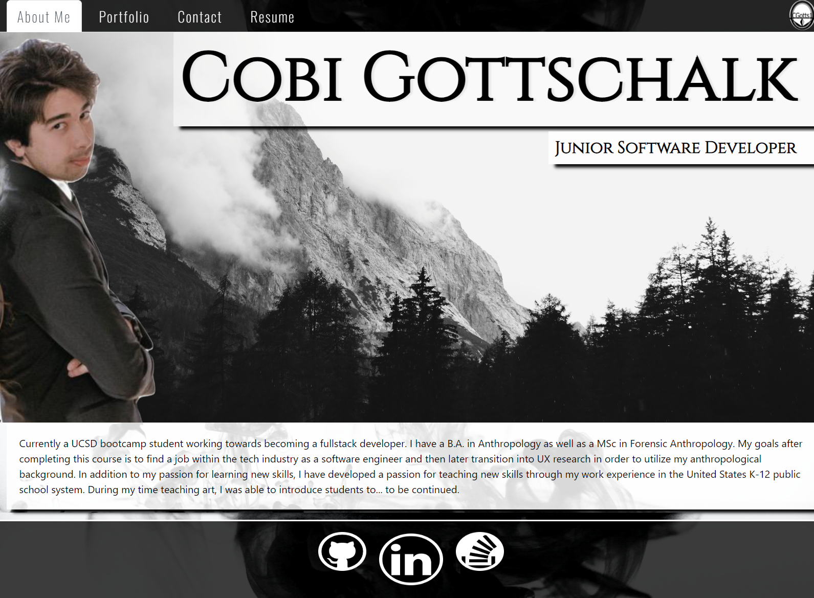

# React-Portfolio

## <section id = "License">License</section>
N/A

## <section id = "Description">Description</section>

This single-page application was made using React.js. Packages such as bootstrap and email.js were brought in for some styling and to provide email functionality. Regex was used to test for email verification and depending on whether the desired information has been filled out, the user will receive feed back on whether there form was submitted. The download attribute was implemented to allow users to download the Curriculum Vitae document. 

Link to deployed application: https://cgotts1.github.io/React-Portfolio/

## Table of Contents
1.) <a href = "#License">License</a> 
2.) <a href = "#Description">Description</a> 
3.) <a href = "#Installation">Installation</a>  
4.) <a href = "#Usage">Usage</a> 
5.) <a href = "#Contributing">Contributing</a> 
6.) <a href = "#Tests">Tests</a> 
7.) <a href = "#Questions">Questions</a>

## <section id = "Installation">Installation</section>
Command to Install Dependencies: npm i

## <section id = "Usage">Usage</section>
Using the Repo: npm run start

## <section id = "Contributing">Contributing</section>
Contributing to the Repo: Currently not taking contributions.

## <section id = "Tests">Tests</section>
Command to Run Tests: N/A

## <section id = "Questions">Questions</section>
If you have any questions, please feel free to contact me:   
1.) Github Username: Cgotts1  
2.) Email Address: cobi.gottschalk@gmail.com